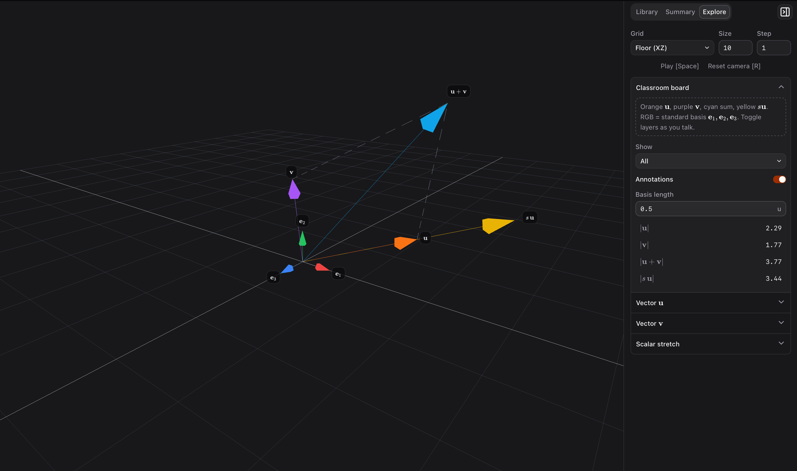

# Scenie

Agent skill + local tools for interactive 2D/3D educational scenes and model showcases — plain Three.js content, with a CLI and browser viewer that own camera, chrome, and controls.

## Examples

### Linear algebra intro



### Pendulum homework


### Solar system


## Who it’s for

**Teachers and students** — explore STEM subjects and concepts with interactive scenes instead of static slides.

**Model showcase & comparison** — build and keep demo scenes for testing and comparing 3D capabilities of AI models (benchmarks, showcases, side‑by‑sides).

## Install

Ask your AI agent to run this command to install the [Scenie skill](https://github.com/igoakulov/scenie/blob/main/skills/scenie/SKILL.md):

```bash
npx skills add igoakulov/scenie --skill scenie -g -y
```

The agent installs the skill and completes other install steps.

### Manual / advanced

**npm package** (Node ≥ 20) — CLI only; still install the skill as above:

```bash
npm install -g scenie
scenie init
```

**From this repo**:

```bash
git clone https://github.com/igoakulov/scenie.git
cd scenie
npm install          # builds CLI + viewer (prepare)
npm link             # optional: put `scenie` on your PATH
scenie init          # or without link: node bin/scenie.js init
```

### How to use

1. Describe: explore the subject/concept with your agent and ask to create a scene with the Scenie skill.
2. Explore: view the scene and its summary from your conversation with agent.
3. Play: use live cards that change the scene, play animation, see how everything interacts!

## Features

- Learn by seeing and doing — turn ideas from a chat with your agent into 3D or 2D scenes you can open in the browser
- Built for class and self-study — clear summaries (including math), labels in the scene, and controls that match what you’re studying
- Hands-on, alive — drag the view, play animation, and change numbers and options to watch objects respond
- Keep a personal library — save many scenes, reopen later, copy or back up the ones you care about
- Example scenes included — try them out, ask agent to tweak them
- Your agent does all the work — you describe the concept; the agent builds and updates the scene
- Works with the agent you already use — Claude Code/Cowork, ChatGPT Work/Codex, and similar

## Under the hood

Agent skill (git) + lightweight npm package (CLI + prebuilt viewer, **~0.5 MB**, **~6k LOC**). Requires Node ≥ 20.

- Portable scene folders: `metadata.json` + plain Three.js `scene.js` (+ optional assets); no proprietary geometry DSL
- Local viewer: library, summary (markdown + KaTeX), Explore cards, orbit (3D) / pan-zoom (2D), grid, play/pause, in-scene annotations
- Interactive params: numbers, booleans, selects, multiselect, strings, notes, computed labels; live remount on edit
- Agent skill: authoring contract, list → write → validate → show loop
- CLI: `init`, `list`, `validate`, `show` over a config workspace; structured stdout for multi-surface context
- Host-owned runtime: lights, helpers, camera, playback defaults with opt-outs; host-driven `update(t, dt)`; validate before show

**Stack**

| Layer | Tech |
|-------|------|
| CLI / server | Node (ESM), TypeScript → `dist/`; local `http` serve of viewer + `/ws/scenes/*` + vendored Three |
| Scene content | Three.js (runtime dependency; import map in the viewer) |
| Viewer | React 19, Vite build → `viewer/dist` (prebuilt for users) |
| Chrome | Tailwind v4, shadcn (Base UI), lucide |
| Math / prose | KaTeX (descriptions + annotations), marked (summary markdown) |

## Acknowledgements

- [Three.js](https://threejs.org/) — scene runtime and content model
- [KaTeX](https://katex.org/) — math
- [shadcn/ui](https://ui.shadcn.com/) — viewer chrome

## License

[MIT](./LICENSE)
